# [DRAFT] How to connect to GlasgowTRE secure VPN and workstation 

## Objective

Use this guide to configure and establish a secure FortiClient VPN connection to GlasgowTRE, authenticate using two-factor authentication (2FA), access your remote TRE research workstation, and sign out securely at the end of your session.

## Before you begin

Make sure you have:

- A **University-owned, managed device** with up-to-date operating system patches and active antivirus software.
- Administrative privileges on your device (or assistance from your local IT support team) to install software.
- Your KeePass database archive (`KeePass-2.61.1.zip` or similar) received via the University of Glasgow transfer system.
- Your master KeePass password delivered via Microsoft Teams.
- Your assigned GlasgowTRE username (formatted as `xxx.xxx.xxx@glasgowtre.ac.uk`) received via email from the TRE support team.
- The `FortiClientVPNInstaller.exe` installer file downloaded from the link provided in your onboarding materials.
- Access to your registered email inbox to receive time-sensitive two-factor authentication codes.
- A stable internet connection on a trusted network (such as the campus network, home broadband, or approved corporate connection).

!!! warning "Security Requirement: Managed Devices Only"
    Access to the Glasgow Trusted Research Environment is strictly restricted to University-owned and centrally managed devices. The use of personal computers, unmanaged laptops, tablets, or mobile phones is strictly prohibited. Any connection attempt originating from an unmanaged device will fail network compliance checks and be blocked.

!!! note "Distinct TRE Credentials"
    Your GlasgowTRE credentials are dedicated to your specific research project and are completely separate from your standard University of Glasgow GUID and email credentials. Never attempt to log in using standard university single sign-on credentials, and never share your TRE login details.

---

## Step 1: Retrieve your login password from KeePass

Your GlasgowTRE passwords are transmitted inside an encrypted KeePass database file to prevent unauthorised exposure.

1. Locate and extract the KeePass database package (`KeePass-2.61.1.zip`) received via the UofG file transfer service.
2. Launch `KeePass.exe`.
3. Open your project database file and enter the master password sent to you via Microsoft Teams when prompted.
4. Locate the entries for your **GlasgowTRE VPN** and **GlasgowTRE Workstation** accounts.
5. Copy or record your unique password. Note that your assigned TRE username (received via your onboarding email) remains constant across both services.

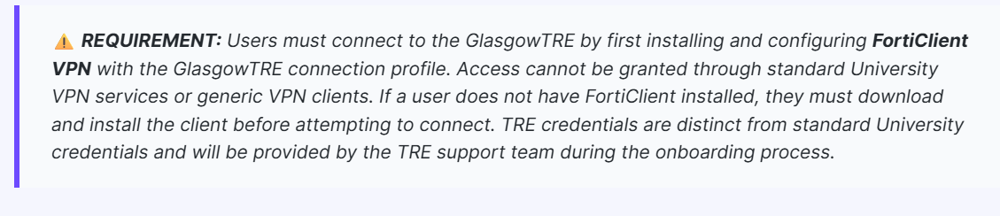

---

## Step 2: Download and install FortiClient VPN

All network communication with the GlasgowTRE infrastructure must travel through an encrypted FortiClient SSL-VPN tunnel.

1. Download the authorised installer file `FortiClientVPNInstaller.exe` from the onboarding link provided by the TRE support team.
2. Run the installer and proceed through the setup wizard using the default installation settings.
3. Open the **FortiClient** application once installation finishes.
4. Select the menu icon (three horizontal lines) in the upper-right corner of the interface and select **Add a new connection**.

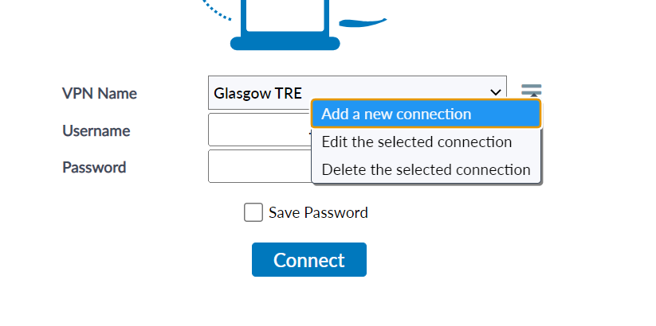

---

## Step 3: Configure the VPN connection profile

Configure a dedicated VPN profile for the GlasgowTRE secure gateway.

1. In the **New Connection** dialogue, select **SSL-VPN**.
2. Enter the connection parameters as specified in the table below:

| Setting | Value |
| :--- | :--- |
| **VPN** | SSL-VPN |
| **Connection Name** | `GlasgowTRE` |
| **Description** | Glasgow TRE Secure Access |
| **Remote Gateway** | `vpn.glasgowtre.ac.uk` |
| **Customize port** | Checked (leave default `443` or as configured) |
| **Enable Single Sign On (SSO) for VPN Tunnel** | Unchecked |
| **Client Certificate** | `None` |
| **Authentication** | Select **Save Login** |
| **Username** | Enter your full TRE username (e.g. `xxx.xxx.xxx@glasgowtre.ac.uk`) |

3. Confirm that the configuration matches the expected gateway details before saving.

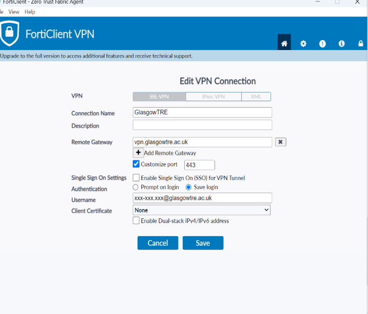

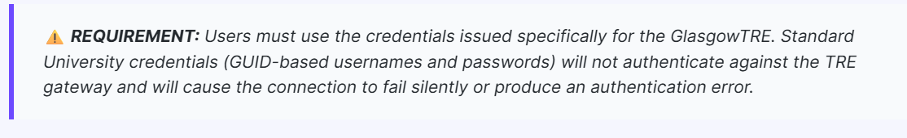

4. Select **Save** to store the connection profile.

---

## Step 4: Connect to the VPN with Two-Factor Authentication

Every VPN session requires multi-factor authentication using a dynamic verification code delivered to your registered email address.

1. On the FortiClient home screen, select the **GlasgowTRE** profile from the **VPN Name** dropdown.
2. Confirm your TRE username is entered correctly.
3. Enter your TRE password retrieved from KeePass into the **Password** field.
4. Select **Connect**.

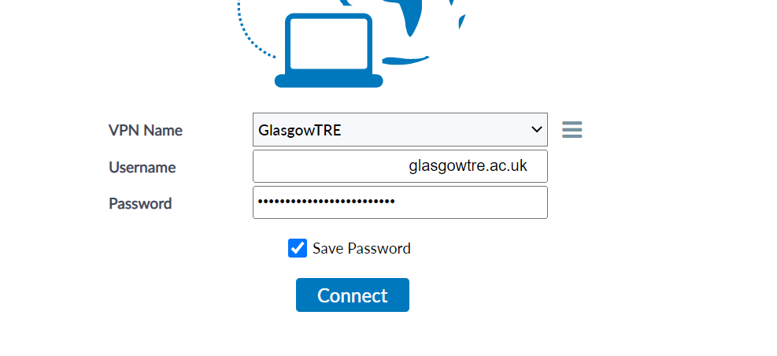

5. When primary credentials are accepted, FortiClient will display a prompt requesting an authentication **Token**.

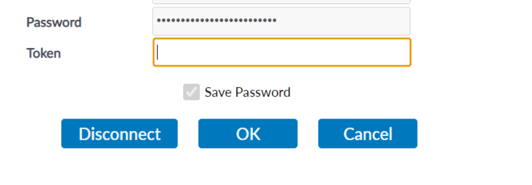

6. Open your registered email inbox and check for a message containing your six-digit authentication code. This email is sent automatically when the token prompt appears.

!!! tip "Enter the Token Promptly"
    The six-digit email token is time-limited. Enter the token into FortiClient immediately upon receipt. If the token expires or is rejected, restart the connection attempt from the FortiClient login screen to request a fresh token.

7. Return to FortiClient, type the six-digit code into the **Token** field, and select **OK**.

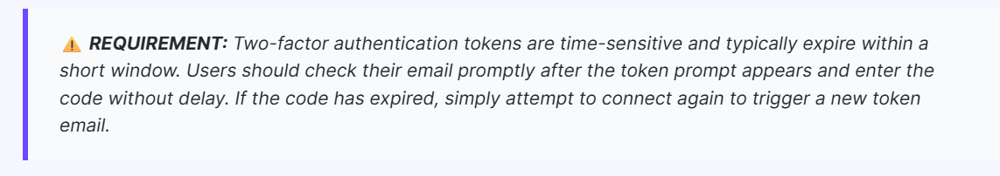

8. Wait for the connection progress to complete. Once established, the FortiClient dashboard displays a green checkmark, your assigned TRE internal IP address, connection duration, and an active **Disconnect** button.

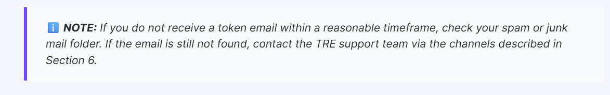

---

## Step 5: Download the Secure Workstation Access package

With the VPN connection established, download the dedicated workstation access package to reach your allocated virtual environment.

1. Ensure your FortiClient VPN is active and connected.
2. Navigate to the Secure Workstation Access download link provided in your onboarding email.
3. If prompted with a browser confirmation to connect to the service, confirm and proceed.

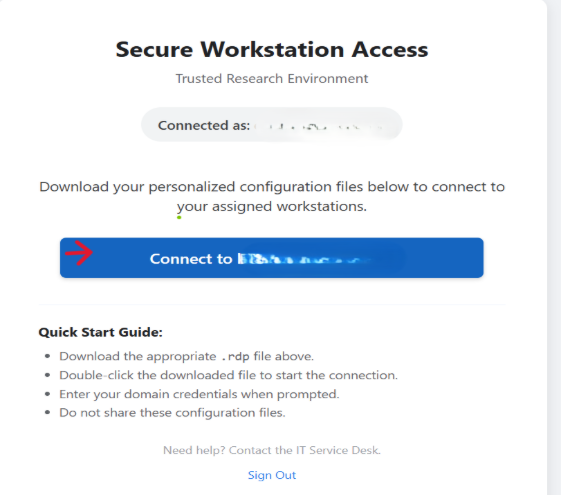

4. If your web browser flags the download with a security warning stating that the file is not commonly downloaded or has an unknown publisher:
   - Select the options menu (`...`) or review panel next to the download item.
   - Choose **Keep** (or **Keep anyway**).

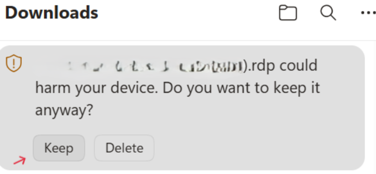

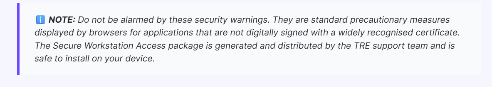

5. Open your local **Downloads** folder and confirm that the workstation executable package is present.

---

## Step 6: Connect to the TRE workstation via Remote Desktop

Launch the workstation connection package to open an encrypted Remote Desktop session into the TRE.

1. Double-click the downloaded workstation executable package in your Downloads folder.
2. When the **Remote Desktop Connection** security dialogue appears with the notice *"The publisher of this remote connection cannot be identified. Do you want to connect anyway?"*, select **Connect**.

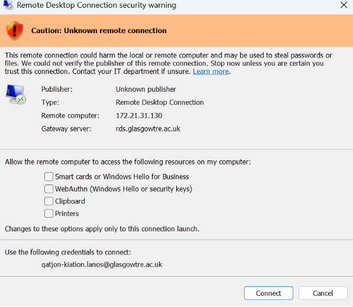

3. On the **Windows Security - RD Gateway Security Credentials** prompt, select **Use a different account**.

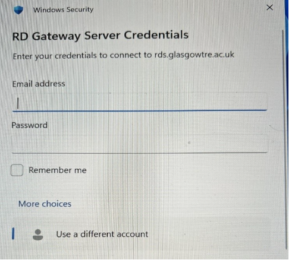

4. Enter your full GlasgowTRE credentials:
   - **User name**: Enter your complete TRE username in the format `xxx.xxx.xxx@glasgowtre.ac.uk`.
   - **Password**: Enter your TRE password retrieved from KeePass in Step 1.
   - Select **OK**.

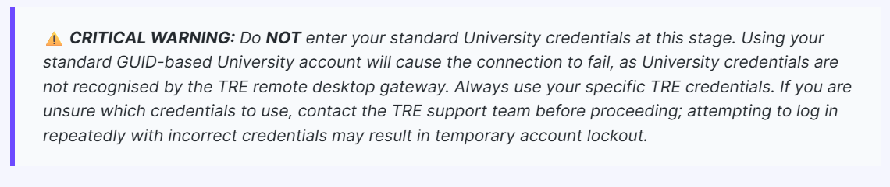

5. When the certificate verification prompt appears stating *"The identity of the remote computer cannot be verified. Do you want to connect anyway?"*, select **Yes** to trust the connection.

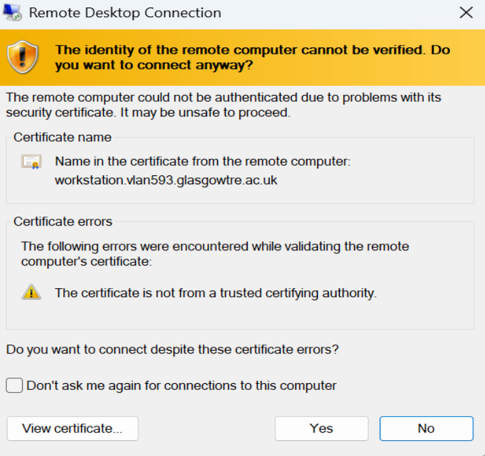

6. The GlasgowTRE workstation desktop will launch in full screen. You are now inside your secure research environment and can access your approved datasets and analytics tools.

---

## Step 7: Sign out securely and disconnect the VPN

Always perform a full sign out from the workstation before disconnecting from the network. Simply closing the remote desktop window leaves active sessions and locks workstation resources.

1. Inside the remote TRE workstation, click the **Start** button on the Windows taskbar (or press the Windows key).
2. Select your **User Profile** icon at the top or side of the Start menu.
3. Select **Sign out**.

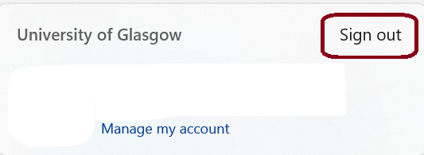

4. Wait for the remote desktop session window to close cleanly.
5. On your local device, open the **FortiClient** window.
6. Select **Disconnect** to terminate the encrypted VPN tunnel.

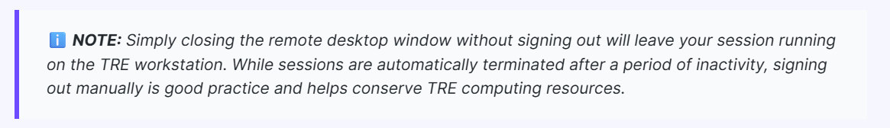

---

## If you need help

If you experience connection errors, need password resets, or encounter issues with two-factor authentication, contact the GlasgowTRE support team.

### Primary support channel: UofG Helpdesk Portal

Log a support ticket through the central University of Glasgow Helpdesk service catalogue:

1. Navigate to the [UofG Helpdesk Portal](https://www.gla.ac.uk/myglasgow/it/helpdesk/).
2. Select **Service Catalogue**.
3. Select **Report Something**.
4. Choose **Glasgow TRE Helpdesk and Technical Support**.

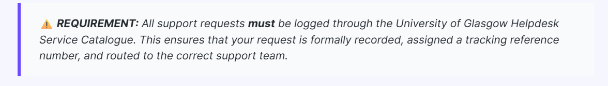

5. Complete the support form with the following details:
   - **Step affected**: Specify the exact step number and process (e.g. FortiClient installation, 2FA code, RD Gateway login).
   - **Error details**: Include exact error messages, error codes, or screenshots of the failure.
   - **Timestamp**: Note the approximate date and time the incident occurred.
   - **TRE Username**: Provide your TRE username (e.g. `xxx.xxx.xxx@glasgowtre.ac.uk`).

!!! warning "Do Not Share Passwords in Tickets"
    Never include your KeePass master password, TRE login password, or two-factor authentication codes in support tickets or email correspondence.

### Urgent support and direct email contact

If the Helpdesk portal is unavailable, or if you are facing a critical project deadline, contact the TRE Support Team directly by email:

- **Email**: [tre@glasgow.ac.uk](mailto:tre@glasgow.ac.uk)

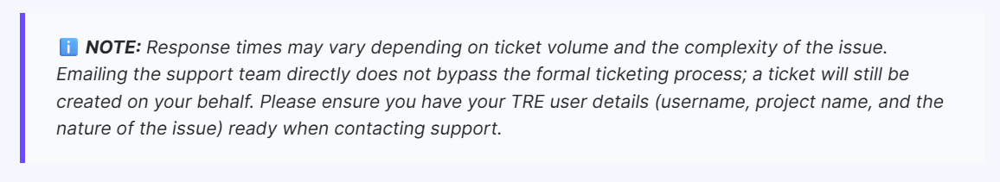
