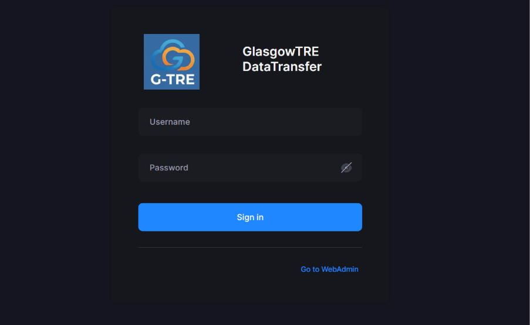
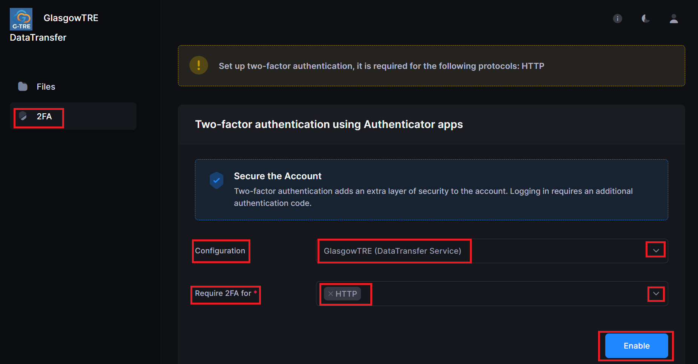
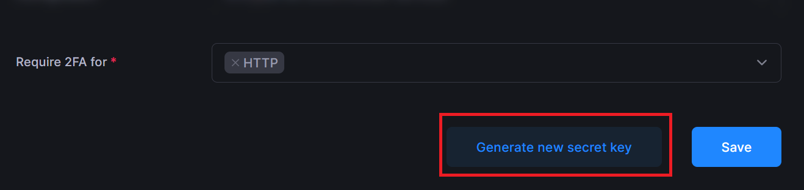
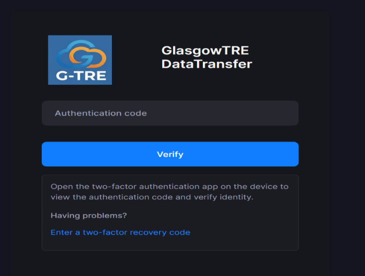
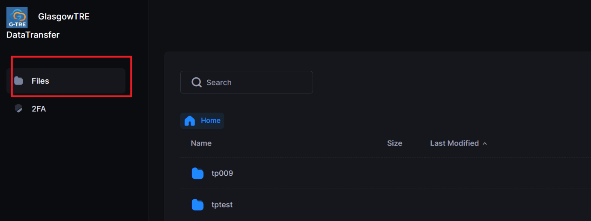
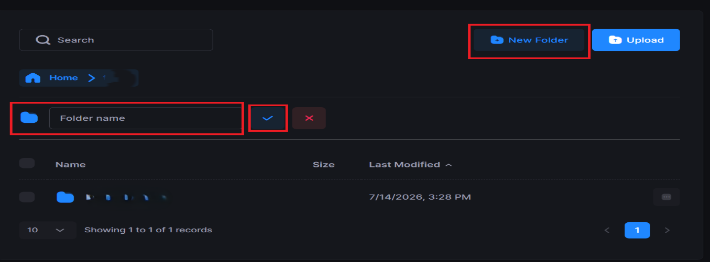
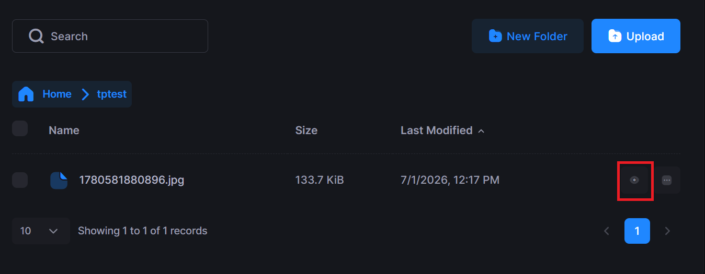
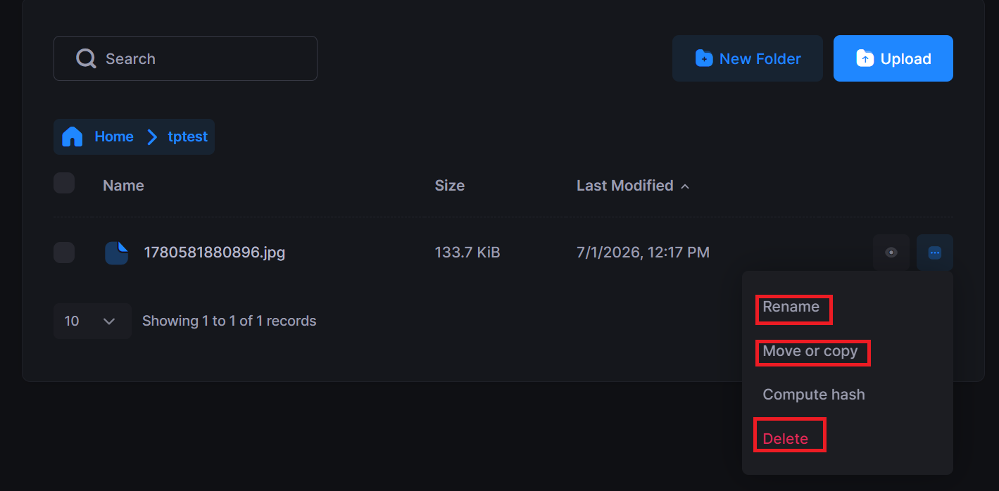
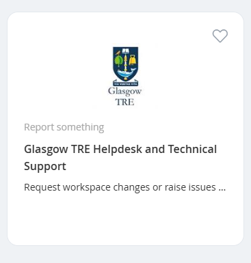

# How to use GlasgowTRE secure web file transfer service

## Objective

Use this guide to sign in to the Glasgow TRE secure transfer service, complete first-time two-factor authentication setup, and begin managing files.

## Before you begin

Make sure you have:

- Your username from the welcome email.
- Your password from the separate communication channel.
- A mobile device with an authenticator app such as Microsoft Authenticator.
- A working internet connection and access to the service URL.

Self-service password changes are not available. If you forget your password or cannot sign in, contact the helpdesk instead of trying to bypass the security process.

## Step 1: Open the service

1. Open the service URL: [http://sftp.glasgowtre.ac.uk/](http://sftp.glasgowtre.ac.uk/)
2. Enter your username and password.
3. Select Sign In.
4. TEST TEST TEST

## Step 2: Complete first-time two-factor authentication setup

On your first successful sign in, you will be asked to configure two-factor authentication.

1. Open the Configuration section.
2. In the service dropdown, choose GlasgowTRE (DataTransfer Service).
3. In the Require 2FA dropdown, choose HTTP.
4. Select Enable.

5. Scan the QR code with your authenticator app.
6. If the QR code cannot be scanned, use the manual entry option instead:
   - Open the authenticator app.
   - Choose Add account.
   - Select Enter code manually.
   - Choose Other (Google, Facebook, etc.)
   - Enter an account name such as Glasgow TRE and the secret key shown on screen.

7. Enter the current six-digit code from the authenticator app into the Authentication Code field immediately.

Codes are time-based and expire every 30 seconds, so enter the latest code as soon as it appears.

## Step 3: Sign in on later sessions

For future visits:

1. Return to the same service URL.
2. Enter your username and password.
3. Enter the six-digit code from the GlasgowTRE (DataTransfer Service) entry in your authenticator app.
4. Confirm that you reach the Files view.

## Step 4: Upload and manage files

Once you are signed in:

1. Open the Files section.
2. Create a new folder if needed by selecting New Folder and giving it a name.

3. Upload files by dragging them into the upload area or using Browse folder.
4. Use Preview, Rename, Move, Copy, or Delete as needed.

!!! tip "Planning large or bulk file transfers (500GB+)?"
    Uploading large datasets through a web browser is prone to tab crashes and network timeouts, and cannot be resumed if interrupted. For high-volume data transfers, we strongly recommend using native SFTP (Port 2022). See our [Data Transfer FAQ](../faq/data-transfer.md) for architecture details, concurrency limits, and recommended client settings.

## Step 5: End the session securely

1. Select the profile icon in the top-right corner.
2. Choose Sign Out.
3. Confirm that you are returned to the sign-in screen.

## If you need help

If you are unable to sign in, cannot use the authenticator app, or need a password reset, contact the UofG Helpdesk through the service catalogue and select the Data (incl. Data ingress/extraction) category. You can also contact the team directly at [tre@glasgow.ac.uk](mailto:tre@glasgow.ac.uk).

<!--  -->

---

### Quick Reference: Recommended SFTP Client Configuration

When setting up your transfer client (Cyberduck, WinSCP, FileZilla, etc.) for large ingest workloads:

| Setting | Recommended Value | Rationale |
| :--- | :--- | :--- |
| **Protocol** | `SFTP` (SSH File Transfer Protocol) | Direct protocol engine, supports byte-offset resuming. |
| **Port** | `2022` | Dedicated native SFTP listener. |
| **Maximum Concurrent Connections** | `1` | Avoids triggering multiple concurrent 2FA challenges. |
| **Transfer Mode / Queue** | Sequential (1 file at a time) | Ensures reliable batch processing through large queues. |
| **Existing Files / Interrupted Action** | `Resume` (or `Append`) | Prevents restarting 500GB+ files from 0% on disconnect. |
